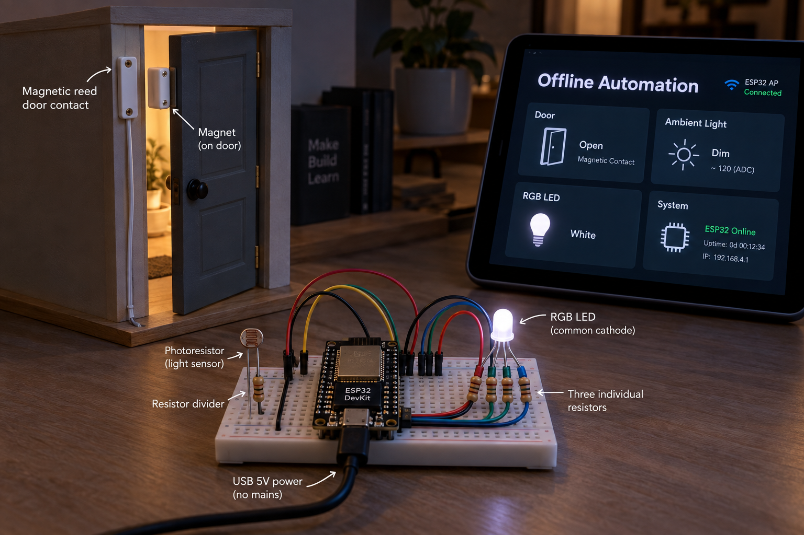
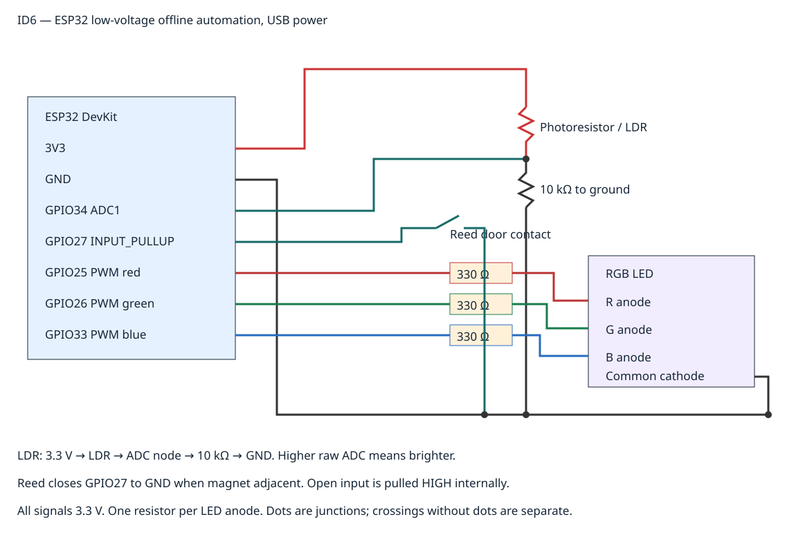

# Room Climate Hub Offline Automation
An ESP32 runs door-and-light rules without internet or a cloud service. A common-cathode RGB LED gives a modest white welcome light when the door is open and ambient light is low; an open door in bright light shows dim green; a closed door turns the LED off.



## Objectives and features
Debounce a reed contact, apply light hysteresis, operate local RGB outputs, and serve read-only status on a local Wi-Fi access point. Rules continue even with no Wi-Fi clients. The generated overview is conceptual; the supplied web interface is a plain text endpoint and JSON, not the illustrated tablet dashboard.

## Architecture and platform
ESP32 Arduino firmware reads GPIO27 and ADC1 GPIO34, runs a tested pure C++ policy, and drives three LEDC PWM channels. Its own access point provides HTTP status; there is no router, DNS, cloud account, MQTT broker or internet dependency.

## Bill of materials
|Qty|Part|
|---:|---|
|1|ESP32 DevKit, USB cable and regulated USB supply|
|1|Normally-open reed contact and magnet (closed contact when magnet adjacent)|
|1|Photoresistor (LDR)|
|1|10 kΩ divider resistor|
|1|Common-cathode RGB LED, 3.3 V-compatible forward voltages|
|3|330 Ω individual LED series resistors|
|1 set|Breadboard and jumpers|
LED is a small indicator, not a room lamp. Check actual LED polarity and pin order.

## Prerequisites
PlatformIO 6.1.18, Python 3, g++ for host tests and a Wi-Fi-capable phone/browser. The pinned espressif32 6.8.1 Arduino target is ESP32 DevKit (esp32dev). No personal Wi-Fi credentials are stored or needed. Hardware testing is a separate activity.

## Exact pin map and circuit


|ESP32|Connection|
|---|---|
|3V3|One LDR terminal|
|GPIO34 ADC1|Other LDR terminal and top of 10 kΩ resistor|
|GND|Bottom of 10 kΩ, RGB common cathode, one reed terminal|
|GPIO27|Other reed terminal, internal pull-up enabled|
|GPIO25|330 Ω → red anode|
|GPIO26|330 Ω → green anode|
|GPIO33|330 Ω → blue anode|
Every LED anode has its own resistor. GPIO34 is input-only and uses ADC1, so Wi-Fi does not conflict with its ADC reading. ADC node is bounded by the 3.3 V divider rail. Do not apply 5 V to any GPIO.

## Assembly
Disconnect USB. Build the LDR divider and check resistor placement, then common ground and reed input. Identify the LED cathode using its datasheet, then connect each resistor/anode. Mount the reed/magnet so a closed door closes the contact. Inspect shorts before powering. Do not attach mains or high-current lighting.

## Setup and flashing
```sh
python -m pip install platformio==6.1.18
pio run -e esp32dev
pio run -e esp32dev -t upload
pio device monitor -b 115200
```
Select the correct upload port if necessary. libraries.md records the pinned framework. CI compiles this same target.

## Configuration
policy.h contains 50 ms debounce and light thresholds: enter dark at ADC ≤1200, exit at ADC ≥1600, retain classification in between. ADC is raw 12-bit (0–4095), not lux; calibrate with your LDR and light levels. RGB duty is [120,120,120] for open+dark, [0,20,0] for open+bright, zero for closed or invalid out-of-range input. Exact GPIO and 5 kHz/8-bit PWM are in the .ino. Change code, SVG and docs together.

## Usage and telemetry
Connect a nearby demonstration device to **OMP-Offline-006**, a deliberately open lab-only access point. It has no password or authentication and provides no Internet. Browser `http://192.168.4.1/` shows endpoint instructions; `http://192.168.4.1/api/status` returns JSON. Confirm the actual IP printed at boot. No HTTP endpoint changes rules or outputs. Serial prints JSON each second:
```json
{"id":6,"door_open":true,"light_raw":900,"dark":true,"fault":false,"rgb":[120,120,120]}
```
id/light_raw are integers, door_open/dark/fault booleans, rgb three duty integers 0–255. sample-data is synthetic representative output. The ADC fault guard rejects out-of-range software values; a physically disconnected sensor can still produce plausible readings and is not reliably diagnosed.

## Expected output and repeatable demonstration
Cover the LDR until below 1200, open the door contact for at least 50 ms: white indicator. Illuminate above 1600 with contact open: dim green. Close contact for 50 ms: off. Between thresholds the prior dark state persists. Disconnect the browser; repeat rules to demonstrate independence from network clients. Never infer lux or measured energy savings from raw ADC.

## Tests and actual run results
Cloud host assertions cover dark hysteresis boundaries, debounce/bounce, RGB decisions, invalid ADC and timer rollover. CI checks PNG transport, PNG/SVG/local links/license/credential patterns and builds the ESP32 firmware. **Actual cloud checks passed:** native policy assertions, three PNG transport regression tests, PNG/SVG/local links/MIT/credential checks and ESP32 target build passed on 421c228fe1fadc7983b89e91cfb5a6f7fdf4a7c3 in [this Actions run](https://github.com/OpenMakerProjects/room-climate-hub-offline-automation/actions/runs/37416498969). Final gates are repeated on this result-documentation commit. No physical wiring, Wi-Fi RF, LED brightness or light calibration test has been performed.
```sh
python tools/validate.py
python tools/validate_completion.py
```

## Troubleshooting
No AP: inspect boot serial and USB power. Phone leaves AP: disable automatic mobile switching for the lab session. HTTP unreachable: use the printed AP IP, not HTTPS. LED wrong color: inspect common cathode and anode mapping. Door always open: check magnet/contact continuity; broken wire reads open. Inverted light: the LDR must be above the ADC node and 10 kΩ below it. No threshold transition: calibrate raw values using JSON.

## Limitations and domain safety
Open AP status is observable by nearby clients; use only a supervised isolated bench with nonprivate test data and power it off afterwards. Add proper authentication before any real deployment. This is not a security alarm or emergency light. Reed broken wires are not distinguished from an open door. Small LED only, low voltage, no mains/hazardous load. PWM and raw ADC require actual hardware verification.

## Future work
Add an authenticated local interface, measured light calibration, hardware-in-loop coverage and explicit sensor fault detection.

## Contributing and license
Include matching pin documentation and tests with PRs. Run host and target checks; report hardware results separately. MIT: [LICENSE](LICENSE).
